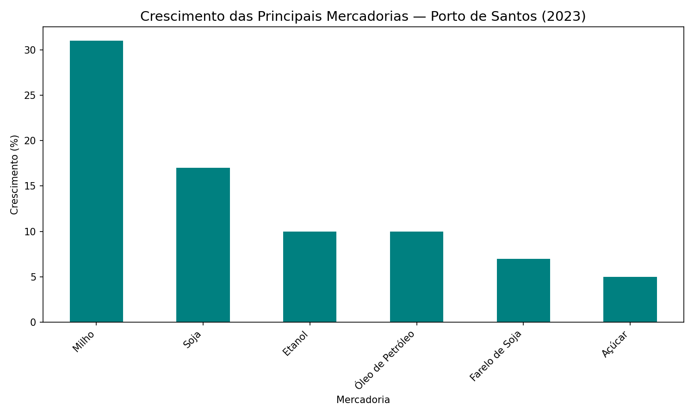

# 🚢 Análise de Movimentação Portuária — Porto de Santos

Análise de dados públicos sobre a movimentação de cargas no Porto de Santos,
o maior porto da América Latina, utilizando dados oficiais da ANTAQ.

## 📌 Sobre o projeto

Este é um projeto de estudo e portfólio em análise de dados, com foco no setor
portuário. O objetivo é duplo: aprofundar meus conhecimentos práticos em análise
de dados e construir um portfólio voltado para a área portuária e logística.

Meu nome é Adriano. Atuo há mais de 10 anos com gestão, hoje principalmente como
**gestor operacional** na operação de atendimento ao cliente — lidando com entrega
de solicitações, cumprimento de prazos e negociação —, além de experiência em
gestão de pessoas e vendas. Estou em transição para a área de dados, unindo essa
vivência operacional à minha formação em gestão portuária (Cenep) e à minha
localização na Baixada Santista, ao lado do maior complexo portuário do país.

Acredito que a análise de dados, somada à minha experiência em operação e gestão,
é um caminho natural para gerar valor no setor portuário e logístico.

## 🎯 Objetivo da análise

Investigar o crescimento das principais mercadorias movimentadas pelo Porto de
Santos em 2023, identificando os destaques do período e o que eles revelam sobre
as tendências do porto.

## 📊 Análise e Resultados

O gráfico abaixo mostra o crescimento (%) das principais mercadorias do Porto de
Santos em 2023, em relação a 2022:

### Principais descobertas

- **O milho foi o grande destaque de 2023**, com crescimento de **31%** — quase o
  dobro da soja, a segunda colocada. Do ponto de vista operacional, um salto desse
  porte pressiona diretamente a infraestrutura de granéis sólidos: mais janelas de
  atracação, maior demanda por armazenagem e um planejamento logístico mais apertado.

- **Os granéis agrícolas (soja e milho) puxaram o crescimento**, ambos acima de 15%.
  Isso reforça o papel de Santos como principal corredor de exportação do agronegócio
  brasileiro.

- **O crescimento médio das mercadorias analisadas foi de aproximadamente 13%**,
  indicando um ano forte e generalizado para o porto, não puxado por um único produto.

- Mercadorias como açúcar, farelo de soja e combustíveis apresentaram crescimento
  mais moderado (entre 5% e 10%), mantendo uma base estável de movimentação.

### Leitura de gestão

Como profissional com vivência operacional, vejo nesses números mais do que
estatística: um crescimento concentrado em granéis agrícolas sinaliza a necessidade
de atenção a gargalos operacionais — filas de caminhões, capacidade de armazenagem
e produtividade de atracação — justamente nos períodos de safra. Antecipar esses
picos é o que separa uma operação eficiente de uma sobrecarregada.

## 📁 Arquivos do projeto

- `analise_porto_santos_2023.csv` — dataset com as mercadorias, crescimento e classificação
- `grafico_mercadorias_santos.png` — visualização do crescimento por mercadoria

## 📊 Fonte dos dados

Dados públicos extraídos do **Anuário Estatístico 2023 da ANTAQ** (Agência Nacional
de Transportes Aquaviários). Disponível em: https://www.gov.br/antaq

## 🛠️ Tecnologias utilizadas

- **Python** — análise e tratamento dos dados
- **Pandas** — manipulação e análise de dados
- **Matplotlib** — visualização de dados
- **Git & GitHub** — versionamento e publicação

## 🚧 Status

Projeto em desenvolvimento contínuo. 🌱

## 📫 Contato

- **LinkedIn:** [Adriano Gibertoni](https://www.linkedin.com/in/adrianogibertoni/)